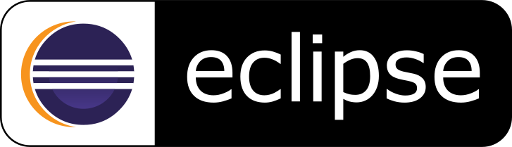

<a href="https://nilostolte.github.io/">

</a>
<a href="https://github.com/nilostolte"></a>&nbsp; <a href="https://twitter.com/nilostolte"></a>&nbsp; <a href="https://dev.to/nilostolte"></a><br><br>
<!--★ &nbsp;Discord: ID nilostolte#1728, [Channel](https://discord.gg/ZZGWnZBups)-->


&nbsp;&nbsp;&nbsp;&nbsp;&nbsp;&nbsp;


## Summary
★ &nbsp;[**Open Letter**](https://github.com/nilostolte/Projects-Presentations/blob/main/OpenLetter.pdf): this letter is a foreword to the work I have been doing lately in terms of research and development.

★ &nbsp;[**Introduction**](https://github.com/nilostolte#introduction_html_anchor)\
  &nbsp;&nbsp;&nbsp;&nbsp;&nbsp;▻ [Vector graphics as a portable solution for GUIs](https://github.com/nilostolte#vg_guis_html_anchor)\
  &nbsp;&nbsp;&nbsp;&nbsp;&nbsp;▻ [Graphics designers as vector graphics GUI creators.](https://github.com/nilostolte#graphics_designers_html_anchor)\
  &nbsp;&nbsp;&nbsp;&nbsp;&nbsp;▻ [Future high resolution screens](https://github.com/nilostolte#hd_screens_html_anchor)\
  &nbsp;&nbsp;&nbsp;&nbsp;&nbsp;▻ [Java Android, AWT, JavaFX, and Swing](https://github.com/nilostolte#java_frame_html_anchor)\
  &nbsp;&nbsp;&nbsp;&nbsp;&nbsp;▻ [Google did it: Dart and Flutter](https://github.com/nilostolte#dart_flutter_html_anchor)\
  &nbsp;&nbsp;&nbsp;&nbsp;&nbsp;▻ [FLutter is just Skia disguised behind the scenes. Could Dart survive?](https://github.com/nilostolte#flutter_skia_html_anchor)\
  &nbsp;&nbsp;&nbsp;&nbsp;&nbsp;▻ [The problem of responsive vector graphics in the web](https://github.com/nilostolte#vectweb_html_anchor)\
  &nbsp;&nbsp;&nbsp;&nbsp;&nbsp;&nbsp;&nbsp;&nbsp;&nbsp;&nbsp; [The problem of typography on the web](https://github.com/nilostolte#typoweb_html_anchor)\
  &nbsp;&nbsp;&nbsp;&nbsp;&nbsp;&nbsp;&nbsp;&nbsp;&nbsp;&nbsp; [Vaadin - How to not use Java on the web](https://github.com/nilostolte#vaadin_html_anchor)\
  &nbsp;&nbsp;&nbsp;&nbsp;&nbsp;&nbsp;&nbsp;&nbsp;&nbsp;&nbsp; [Figma - The Ultimate Solution](https://github.com/nilostolte#figma_html_anchor)\
  &nbsp;&nbsp;&nbsp;&nbsp;&nbsp;&nbsp;&nbsp;&nbsp;&nbsp;&nbsp; [What can we learn from Figma?](https://github.com/nilostolte#learnfromfigma_html_anchor)\
  &nbsp;&nbsp;&nbsp;&nbsp;&nbsp;&nbsp;&nbsp;&nbsp;&nbsp;&nbsp; [HTML 5 Canvas vector Graphics API](https://github.com/nilostolte#html5_html_anchor)\
  &nbsp;&nbsp;&nbsp;&nbsp;&nbsp;▻ [Vector GUI Everywhere](https://github.com/nilostolte#VGUIeverywhere_html_anchor)
  
★ &nbsp;[**Activities**](https://github.com/nilostolte#activities_html_anchor)\
  &nbsp;&nbsp;&nbsp;&nbsp;&nbsp;▻ [**Current Activities**](https://github.com/nilostolte#current_activities_html_anchor)\
  &nbsp;&nbsp;&nbsp;&nbsp;&nbsp;&nbsp;&nbsp;&nbsp;&nbsp;&nbsp; [Modification of SVG-Edit](https://github.com/nilostolte#svgedit_html_anchor)\
  &nbsp;&nbsp;&nbsp;&nbsp;&nbsp;&nbsp;&nbsp;&nbsp;&nbsp;&nbsp; [GitHub web site](https://github.com/nilostolte#gitsite_html_anchor)\
  &nbsp;&nbsp;&nbsp;&nbsp;&nbsp;&nbsp;&nbsp;&nbsp;&nbsp;&nbsp; [𝝅 desktop calculator](https://github.com/nilostolte#𝝅calc_html_anchor)<br>
  &nbsp;&nbsp;&nbsp;&nbsp;&nbsp;▻ [**Future Activities**](https://github.com/nilostolte#future_activities_html_anchor)\
  &nbsp;&nbsp;&nbsp;&nbsp;&nbsp;&nbsp;&nbsp;&nbsp;&nbsp;&nbsp; [thinking about it](https://github.com/nilostolte#future_activity_1_html_anchor)\
  &nbsp;&nbsp;&nbsp;&nbsp;&nbsp;▻ [**Previous Activities**](https://github.com/nilostolte#previous_activities_html_anchor)\
  &nbsp;&nbsp;&nbsp;&nbsp;&nbsp;&nbsp;&nbsp;&nbsp;&nbsp;&nbsp; [Examples of vector graphics in Java](https://github.com/nilostolte#previous_activity_1_html_anchor)\
  &nbsp;&nbsp;&nbsp;&nbsp;&nbsp;&nbsp;&nbsp;&nbsp;&nbsp;&nbsp; [Functionalities using PDFBox](https://github.com/nilostolte#previous_activity_2_html_anchor)\
  &nbsp;&nbsp;&nbsp;&nbsp;&nbsp;&nbsp;&nbsp;&nbsp;&nbsp;&nbsp; [Functionalities using FreeHEP](https://github.com/nilostolte#previous_activity_3_html_anchor)\
  &nbsp;&nbsp;&nbsp;&nbsp;&nbsp;&nbsp;&nbsp;&nbsp;&nbsp;&nbsp; [Major recent projects](https://github.com/nilostolte#previous_activity_4_html_anchor)

★ &nbsp;[**Interesting Articles**](https://github.com/nilostolte#articles_html_anchor)\
  &nbsp;&nbsp;&nbsp;&nbsp;&nbsp;▻ [We’re not prepared for the end of Moore’s Law](https://github.com/nilostolte#moore_html_anchor)
  
★ &nbsp;[**Hints and programming hacks**](https://github.com/nilostolte#hints_html_anchor)\
  &nbsp;&nbsp;&nbsp;&nbsp;&nbsp;▻ [Classification in GUIs and 2D graphics](https://github.com/nilostolte#classif_html_anchor)\
  &nbsp;&nbsp;&nbsp;&nbsp;&nbsp;▻ [Java SIMD Vector API supports ARM SVE!](https://github.com/nilostolte#armsimd_html_anchor)\
  &nbsp;&nbsp;&nbsp;&nbsp;&nbsp;▻ [Visualization of the execution of a JVM function](https://github.com/nilostolte#jvmvis_html_anchor)\
  &nbsp;&nbsp;&nbsp;&nbsp;&nbsp;▻ [Java `Graphics2D`: you don't need double buffering](https://github.com/nilostolte#doubleb_html_anchor)\
  &nbsp;&nbsp;&nbsp;&nbsp;&nbsp;▻ [UTF-8 the ultimate standard for UNICODE texts](https://github.com/nilostolte#utf8_html_anchor) <a name="introduction_html_anchor"></a>
  
★ &nbsp;[**Art**](https://github.com/nilostolte#art_html_anchor)\
  &nbsp;&nbsp;&nbsp;&nbsp;&nbsp;▻ [Art-Vector](https://github.com/nilostolte#art_html_anchor): Vector Art portfolio showing several vector graphics designs I have developed for different reasons.\
  &nbsp;&nbsp;&nbsp;&nbsp;&nbsp;▻ [Memes](https://github.com/nilostolte#meme_html_anchor): some humor to start with?
<hr>

## Introduction

Citizen of Canada and France, I am creative, autonomous, experienced, self-motivated, and after an entire career of **software engineer**, **researcher in Computer Science**, and **university professor**, having extensive experience in **C++** and **Java** programming (desktop and Android), in enterprise management, and in research, I am nowadays focusing in innovative graphics user interfaces (GUIs) using **vector graphics** in Java desktop applications as well as in Android, now using [HTML 5 Canvas with Javascript](https://nilostolte.github.io/) and other languages, with impressive results in appearance, performance and display independence. This work has a tremendous reach in terms of longevity as well as in reduction of costs of graphics user interfaces. <a name="vg_guis_html_anchor"></a>The vector graphics paradigm is almost universal and has been available in some languages and it has been recently migrating to hardware in the form of standard APIs.<br>

### Vector graphics as a portable solution for GUIs

Since [vector graphics paths](https://github.com/nilostolte/ClockWidget/blob/main/README.md#path-commands) are very high level abstractions, although able to define complex low level shapes, they can also be seen as part of a **generic metalanguage** which is platform, operating system and language independent. In other words, one can define GUIs using vector graphics primitives which are at the same time efficient (since we are actually dealing with the lowest level layer of vector graphics pipeline) and portable, since these primitives are practically universal, having only tiny differences between different languages and platforms. 
This means that it is very easy to port a vector graphics GUI from one language to another, or from a platform to another, or an operating system to another. <a name="graphics_designers_html_anchor"></a>Not only that but the automatization of these transformations is not at all rocket science and actually not very complex. These **transcompilers**, though, may be quite labor intensive depending on the level of details of their implementation.

### Graphics designers as vector graphics GUI creators.

The main advantage of using vector graphics primitives for GUI contruction on the other hand, are neither one cited above. The actual quite important
consequence of such choice is to be able to use vector graphics art conceaved by **graphics designers** to define the GUI shapes and their appearence.
For a long time GUIs were exclusively designed by programmers, not artists, and had terrible appearences and no appeal. Not only that but **frameworks** 
for GUI construction, which are basically designed by programmers, are extremely standardized, difficult to be customized and complex to learn and use.

But now **web development** enthusiasts are trying to convince artists that **programming is easy** and **JavaScript** is seen like a panacea. Artists
had already a hard time to adapt to **Illustrator**, but now we are telling them to go a step further and submit to a totally **abstract way** of
producing their art.

Only a small amount of graphics designers would be interested in doing **design and programming**, and few will have both skills at reasonable level.
In average one side could be good but the other sacrified. We have already forced artists to learn vector graphics production. Even though interactive
tools make this task easier to them, artists had to adapt to all idiosyncrasies of vector graphics, particularly using **Bezier curves**. All
mathematical aspects of Bezier curves are hidden to them, but some practical aspects are often missed, like setting control points touching the curve
in minimal and maximal points. These aspects come as an **option**, and they generally only improve with the experience.

With the possibility to use **artwork from graphics designers** this whole perspective radically changes. In addition to that graphics designers are
much cheaper and more creative than programmers. <a name="hd_screens_html_anchor"></a>It looks obvious that vector graphics is definitely the solution
for modern and fancy GUIs.

### Future high resolution screens

But these are not the only advantages of using vector graphics for GUI creation. Its known intrinsic characteristic is of being **insensitive to the screen resolution**. One can for example zoom any part of the interface [without any loss of quality](https://github.com/nilostolte/Projects-Presentations/blob/main/%CF%80%20Vector%20GUI%20for%20Java%20and%20Android.md#basic-definitions). This not only means that one can design far different GUIs having **zooming** as part of its interactive process but also that the same interface can run in a variety of different screen resolutions. With the advent of **4K** and **8K** monitors and panels, and maybe even higher resolutions in the future, this is a fundamental feature for the **portability** of the same interface in different screen resolutions. With screen technology growing faster than the hardware to display the information, vector graphics can be seen as the graal for solving this kind of problem. What's amazing is that barely no one is using it nowadays, <a name="java_frame_html_anchor"></a>and we will eventually have a problem where all applications will need to migrate to vector GUIs anyway.

### Java Android, AWT, JavaFX, and Swing

Java does supply vector graphics primitives, either in Java Core or Java Android. In Java Core this is mostly done using AWT, Graphics2D in particular, and using `Path2D` (most often `Path2D.Float`) to define shapes. Android has a similar feature: [`Path`](https://android.googlesource.com/platform/prebuilts/fullsdk/sources/android-30/+/refs/heads/androidx-main-release/android/graphics/Path.java). Analysing the code in the link one realizes that Android implements these primitives as _native_ functions, that is, in machine language, thus, more efficient than AWT. A common ground between [`Path`](https://android.googlesource.com/platform/prebuilts/fullsdk/sources/android-30/+/refs/heads/androidx-main-release/android/graphics/Path.java) and  `Path2D.Float` is that both deal with coordinates in _float_ intead of _double_, even though AWT also offers `Path2D.Double`. The use of `float` is clearly more efficient.

It is possible to contruct GUIs in Java Core exclusively using AWT and also only using a `JFrame` and _buffering_, thus, completely avoiding double buffering (`JPanel`), which most people agree is slower. This is discussed [here](https://github.com/nilostolte#doubleb_html_anchor). The main point of using only AWT is that
it falls into the frame of the whole discussion in this page, as opposed to using Swing or JavaFX, for example.

Swing is a GUI framework in Java Core that supplies a high level solution to construct GUIs. It is a very popular framework, 
but it is only portable within the context of Java Core applications. The main problem with Swing is the problem of every GUI
framework, that is, it pratically forces one to construct GUIs in a certain way. The approach is to offer predefined _widgets_
that can be used to build the interface and some internal structuring of the interface. The goal is to accelerate GUI
construction, but one often start spending considerable time into the idiosincrasies of the framework instead of doing actual
real work. On the other hand, without predefined _widgets_ or internal structuring, one is obliged to code them oneself, which 
is often considered as cumbersome or _extra work_. The advantage of doing that, though, is that the code is free from that
particular framework dependency and it can be often reused in other contexts within the same language (as in
Java Android, for example) or even outside of the context of the initial language (as in other programming languages 
supporting vector graphics). This _extra work_ is seen here as the price to pay to have a highly _decoupled_ code. A 
_decoupled_ code is much easier to port and to be reused elsewehere, and most times it is simpler and esier to understand.

JavaFX is also a GUI framework now offered separately of Java Core, but it also supplies a `Path` feature, which
would in normal ciscunstances be considered a quite interesting feature. Differently than Android's `Path` and AWT's
`Path.Float`, though, it not only exclusively uses _double_ values, but also its internal code is considerably more 
cumbersome and intrincate, indulging maybe far too much in object oriented design and transforming something that was
once simple, into a bloated and difficult to understand piece of code. JavaFX has been also the target of critics for its
unusual usage of CSS (which in itself has already a quite awkward syntax), its low performance, its lack of many features 
and of being difficult to use or to accomplish desired effects. We recognize in some of these criticisms the "_footprint_" 
of many other GUI frameworks such as GTK, Qt, Motif and many others. The common ground of all of them is that the resulting 
interface is often considered ugly, outdated, and the framework itself bloated, <a name="dart_flutter_html_anchor"></a>not 
well documented, too many useless features, and so on.

### Google did it: Dart and Flutter

Not everybody ignored all the vector graphics advantages in GUI contruction. **Google** didn't. That's the reason Google 
created **Flutter** and the language **Dart**. Dart can be seen as an enhanced revamped version of a vector graphics 
programming language and Flutter is cross-platform application development framework. Dart and Flutter seem to be the 
solution for constructing GUIs and GUI-based applications. Despite its growing popularity, **Dart and Flutter have caveats**. 
The main one is the fact of that Flutter is bulky and quite complex. 

But Google just didn't fall in the **trap of imposing a framework** desguised behind a programming language. Dart is a 
real programing language that also allows the use vector graphics primitives through the class 
[`Path`](https://api.flutter.dev/flutter/dart-ui/Path-class.html) in the 
[**painting**](https://api.flutter.dev/flutter/painting/painting-library.html) library, similarly than in Java. The 
only inconvenient is that it only offers parameters in **double**, instead of Java that also offers **float** parameters.
The language has many similarities with **JavaScript** and **Java**.

The whole **marketing** behind Flutter seems to actually hide that and rather stresses how easy it is to produce applications. 
<a name="flutter_skia_html_anchor"></a>Therefore the whole thing is sold as just like another framework, although we are 
actually in the presence of a new programming language that is supposed to be portable with portable GUIs.

### Flutter is just Skia disguised behind the scenes. Could Dart survive?

What is behind Flutter is **Skia**, a vector graphics library for **C++**. It is a quite complex and heavy library but it can
be seen as a very good alternative for building vector graphics GUIs in C++ instead of **Qt**, since Qt is just a framework. 
This bring us to the fundamental limitation of Flutter and Dart for this score. It is designed to generate **machine language**, 
not **high level** and **portable** building blocks like vector graphics primitives.

This also brings us to the ultimate conclusion that there is probably no way to escape from **vector graphics primitives** 
to produce applications that have really portable GUIs. Does that mean that **Dart is a dead end?** The answer is no. We know 
Flutter and Dart are **open source**. Dart doesn't limit any vector graphics primitives for being accessed directly. The final
cut of Dart is that it is a language of great importance for Google, since it is part of 
[**Fushia**](https://fuchsia.dev/fuchsia-src/get-started/sdk/learn/intro/architecture) operating system as indicated below:
                                                                                                       
<a href="https://fuchsia.dev/fuchsia-src/get-started/sdk/learn/intro/architecture">
 
</a><br><br>

**Fuschia** could be the answer for an efficient desktop operating system as well as for smaller embedded
platforms. Future versions of Android operating system will accept 
[**Fuchsia archive format (FAR)**](https://fuchsia.dev/fuchsia-src/development/source_code/archive_format). <a name="vectweb_html_anchor"></a>
This alone is quite telling and might indicate that the new operating system will substitute Android. All this might also indicate that 
Google is probably developing something similar to what Apple did with iOS, but completely open source. This is apparently a completely 
new universe that Google is creating, although the plans for thi new OS still remains misterious nowadays.

### The problem of vector graphics on the web

Vector graphics on the web exists for a very long time with **SVG** (Scalable Vector Graphics). SVG, however, is approriate for static designs but not for active and live features such as in animations and widgets. The problem is that it is not efficient enough for real time interactivity. But there is a recent solution nowadays, and I explain that at the [end of this section](https://github.com/nilostolte#html5_html_anchor).

Besides active and live contents we also have problems with **fonts** on the web. Even if the problem of vector fonts is solved as we can see below, <a name="typoweb_html_anchor"></a>it is the structure and the rendering of html itself that became a problem, as far as zooming capabilities are concerned.

#### The problem of typography on the web

There is no better example of how **typography** performs badly on the web than this video from Kevin Powell about "responsive typography" on the web:

<a href="https://www.youtube.com/watch?v=fs9uJ7I4a70">
  
</a><br><br>

What is really wrong there? What's wrong is that when one modifies the size of the window the text never scales properly. What they use to try to paliate the problem is a complex animation based scale change of fonts to make it appear similar to actually scaling the page, but that is obviously not what is happening there. Why not scaling the page entirely? Because it requires vector graphics and in the web nowadays it is not enoughly "responsive", unless we are talking about a static design such as shown [here](https://nilostolte.github.io/). As we can see in [this site](https://nilostolte.github.io/) it is fairly easy to obtain "responsive" zoomable and near WYSIWYG vector typography and vector graphics on the web using conventional web technology, provided the elements are static, not part of animations.

I have seen claims that what **Typetura** is aiming is size-specific adjustments to type designs as proposed by Tim Ahrens and Shoko Mugikura in ["Size-specific adjustments to type designs – An investigation of the principles guiding the design of optical sizes"](https://justanotherfoundry.com/size-specific-adjustments-to-type-designs). In this proposal the _shapes_ of the glyphs change with the scale as it has been observed in typography for many centuries and thanks to new psychological research in this subject. Here it is an example of how a metal typography font would change according to the scale:

<p >
<br>
<i>ATF Garamond, from left to right: 6, 8, 10, 12, 14, 16, 18, 24, 72 pt</i>
</p>

If there is a future of **typography** on the web or in electronic typography in general, this would be it for sure. But this is not what Typetura is doing. Typetura is merely scaling fonts and not changing their shapes according to the scale as proposed by Tim Ahrens and Shoko Mugikura. In other words, what Typetura is actually doing is just trying to adapt WYSIWYG (What You See Is What You Get) to the web as it is now.

However, one can easily see that what you get with the solution in the video is not what you want to see. The solution is a real responsive WYSIWYG experience that scales the text as one increases and decreases the size of the window, that is, actually scaling the whole contents according to the size of the window. This can only be obtained by rendering the window contents as vector graphics that are very easily scalable, as seen [here](https://nilostolte.github.io/). But the solution shown in [this site](https://nilostolte.github.io/) only works well for static sites.

If the solution should include dynamic content, it is maybe through an open source library offering to render vector graphics in WebAssembly. Why open source? Because although WebAssembly is very powerful it is also very dangerous because it can convey malicious code without the user noticing. <a name="vaadin_html_anchor"></a>When a software is open source it is scrutinized by programmers who will identify malicious code if it exists.

#### Vaadin - How to not use Java on the web

Vaadin is a tentative to use **Java** on web programming but unfortunately in the wrong way. Vaadin actually tries to imitate UI frameworks such as the one found in Android or Java Core for desktop, but forgetting the most important stuff: `awt` JRE libraries and vector graphics primitives. In the video below one can clearly see how Vadiin is not the solution for Java UI on the web, because of its very obscure API and framework oriented structure:

<a href="https://www.youtube.com/watch?v=TGSDz-_dNhI">
  
</a><br><a name="figma_html_anchor"></a><br>

The problem with Vaadin is that exactly the framework aspect is what should be thrown away.

#### Figma - The Ultimate Solution

**Figma** is definitely the ultimate solution of vector graphics for the web and the future of GUI/UI on the web is in this kind of solution. Although Figma is very good, their solution is quite expensive, because it offers not only an integrated environment for vector graphics production but also to manage and integrate different designs to construct a whole application without programming.

Nonetheless, Figma's approach is very similar to what I propose, with the difference that Figma allows you to build designs over the web, making it ideal for working in groups, particularly remotely. Although there are a few points where I disagree with Figma's philosophy, I almost entirely agree with it. I believe that designing for the web is a fantastic idea. Figma, on the other hand, does not fully integrate the design into a programming context. The benefit of directly generating code is that it may be readily incorporated and reused in a variety of environments, including the web in WebAssembly. 

<a name="learnfromfigma_html_anchor"></a>Security difficulties arise from the use of WebAssembly in closed environments like Figma, because no one knows what a WebAssembly function is doing. Open source programming is the answer to this problem. However, because Figma is not open source, this will be impossible to achieve.

#### What can we learn from Figma?

Figma, on the other hand, gives us a great deal of useful information. We can benefit from their expertise because we'll already know which points don't work and which do. Here are some of their [conclusions](https://www.figma.com/blog/building-a-professional-design-tool-on-the-web/#rendering):

> * _HTML and SVG contain a lot of baggage and are often much slower than the 2D canvas API due to DOM access. These are usually optimized for scrolling, not zooming, and geometry is often re-tessellated after every scale change._
> * _There is no guarantee about GPU acceleration and many things are still rendered on the CPU, which can be quite slow in certain cases._
> * _Support for masking, blurring, and blend modes in HTML and SVG varies wildly between browsers and is often not anti-aliased or is too low resolution on high-DPI displays._
> * _The 2D canvas API is an immediate mode API instead of a retained mode API so all geometry has to be re-uploaded to the graphics card every frame. This is needlessly wasteful and can become a bottleneck._
> * _Text layout is inconsistent between browsers and is even inconsistent between the same browser on different platforms._
> * _We wanted to be able to add features such as angular gradients which are not supported by any of these rendering APIs._

We resonate a lot with these conclusions and these are points we have already explicitly or implicitly evoked here. But their analysis coincide even more with my observations and longly spoken about in many repositories here:

> * _Our biggest pain point is lack of access to glyph outlines and kerning tables which there currently isn’t any way of getting at. One of the primary concerns is fingerprinting, but that battle has already been lost. We’re hoping access to font data can be exposed behind a user permission prompt like other privacy-sensitive APIs. Chrome has come up with a proposal for a fix that’s currently in the works (they’ve been really helpful!) but there’s nothing else on the horizon for other browsers._

I have solved this problem by using fonts directly and reading all the needed information using [OpenType.js](https://github.com/nilostolte/Projects-Presentations/blob/main/Automatic%20Vector%20Fonts%20Generator%20Project.md#automatic-vector-fonts-generator-project--glyphs-their-widths-and-kerning-pairs) and by developing my own [right justification of texts](https://github.com/nilostolte/Projects-Presentations/blob/main/BreakIntoLines.md#breakintolines-project). In other words I implemented my own font rendering engine.
The inconvenient is that the selection of texts must be also handled internally as it is done in PDF viewers and that the text is not searchable, which is a classical problem PDF documents also have. But our goal is not to be searchable but to be portable across every platfrom, including the web.

> * _We would love to add support for common clipboard formats (.ai, .pdf, etc.) but the web has no way to do this. The only formats in the spec are text/plain and text/html (our Figma clipboard “format” is text/html with binary data encoded in an HTML comment)._

This is a very clever idea of copying a portion of the screen and pasting as text and html with binary content in HTML comments.

Many other ideas of the difficulties found and several solutions are also mentioned in [this original document](https://www.figma.com/blog/building-a-professional-design-tool-on-the-web).

<a name="html5_html_anchor"></a>
We can conclude that GUI tools for the web don't seem to be the solution for portable interfaces basically due to portability issues among different browsers and even among the same browsers in different systems. Figma experience seems to corroborate my views. Interestingly enough, the concerns in Figma, according to their observations shared above, seem strangely similar to my own. As far as GUI design and GUI portability are concerned, the current approach on the web might be actually hinting us that what we are doing is the opposite of what is actually required.

#### HTML 5 Canvas Vector Graphics API

This API is significantly faster than SVG and it allows (with some clever workaround) to have efficient as well as scalable live vector designs. Some people claim that `Canvas` is a bitmap feature and not really vectorial. This is not entirely correct. `Canvas` itself is a bitmap representation, but the vector graphics API allows building scalable graphics by just increasing the size of the `Canvas` dynamically in the cases when the scale changes. `Canvas` is a fairly recent addition to W3C standards and it is what allows games to be able to be ported for the web as we have been seeing.

But games are not the only applications that can be done with it. One can also code a whole web application using `Canvas` and vector graphics API. Even though very powerful, this API is not a panacea. I have found limitations that restrict its use for very complex and more professional applications. For example, clipping doesn't work properly if used more than once. What is missing is a library offering operations to join, subtract and intersect vector objects to generate more complex objects, such as the ones found in Java's awt `Area` or in Android's [`Path`](https://android.googlesource.com/platform/prebuilts/fullsdk/sources/android-30/+/refs/heads/androidx-main-release/android/graphics/Path.java). These operations can also be found in many vector graphics editors such as Illustrator and Inkscape.

Figma is using such a library, probably in WebAssembly. One of the problems with Figma is that it is a closed environment as cited previously. But such a library as an open source project would not only allow free and general use of these features but also solve any security issues concerning the code since its source code anybody can see.  <a name="VGUIeverywhere_html_anchor"></a>In an industrial environment these libraries can be modified for specific use. For example, the internal representation of objects could be different to avoid having their designs stolen.

### Vector GUI Everywhere

As we can see, what is proposed here is a coherent and portable way of building GUIs based on code that can be used everywhere including (and particularly) on the web. The best language to code completely portable interfaces according to nowadays availability of WebAssembly compilers as well as vector graphics support is probably **Go**. This still has to be demonstrated, but Figma is enough proof that this concept works.

The idea of using **Go** is that the same interface that can be compiled to a particular machine code (to be used in a desktop or mobile) can also be compiled to WebAssembly to be used on the web with only very small changes. The simplicity of **Go** and the ability to perform custom memory management also helps a lot in terms of portability and performance.

It is also possible to use Java but its use and compilation to WebAssembly is not as straighforward nowadays as with **Go**, which seems to be the ideal language to build interfaces in the near future. Of course that with the generalization of WebAssembly also to desktop and mobiles, any language could be used but rare are the languages having the vector graphics support of **Go** language. **Go** is maybe here to stay if one thinks about vector GUIs everywhere.<a name="activities_html_anchor"></a>

<hr>

## Activities <a name="current_activities_html_anchor"></a>

<a name="svgedit_html_anchor"></a>
### Current Activities
- **Modification of SVG-Edit**: <a name="gitsite_html_anchor"></a>installation of SVG-Edit in order to modify it to export code in Java and other languages from SVG designs.
- [**GitHub web site**](https://nilostolte.github.io/): (paused) this website is a proof of concept of the use of vector graphics on the web using HTML 5 Canvas and its vector graphics API. Nowadays using Javascript to build the shapes and to use the API. <a name="𝝅calc_html_anchor"></a>The objective is to pass to WebAssembly possibly using **Go** language for portability of the code everywhere and for performance.<a name="𝝅calc_html_anchor"></a>
- 𝝅 **desktop calculator**: (paused) a revamping of my [previous multi-precision scientific calculator](https://github.com/nilostolte/Projects-Presentations/blob/main/%CF%80%20Vector%20GUI%20for%20Java%20and%20Android.md#origins-of-the-system) for Android known as MaxCalc. This version is a desktop version that is a much more flexible application, not only integrating new features such as complex numbers, parenthesis prioritized operations, new computation calculus libraries, copy-pasting of values, etc., but it also implements a GUI entirely based on vector graphics primitives (previously it used a homemade framework library of widgets as explained [here](https://github.com/nilostolte/Projects-Presentations/blob/main/%CF%80%20Vector%20GUI%20for%20Java%20and%20Android.md#origins-of-the-system)), uses a much 
more flexible and extensible approach for function implementations using lambda expressions, variable sized and zoomable window,etc. This application is going to be offered as an open source software on GitHub once it is completed. The main idea is to use it as a demo for vector graphics GUI.<a name="future_activities_html_anchor"></a>

<a name="future_activity_1_html_anchor"></a>
### Future Activities
- thinking about it <a name="previous_activities_html_anchor"></a>

<a name="previous_activity_1_html_anchor"></a>
### Previous Activities
- **Examples of vector graphics in Java**
  -  [**ClockWidget**](https://github.com/nilostolte/ClockWidget): analog vector graphics clock in Java that gives the real time on a desktop (wholly developped in Java, but the design was inspired by a vector clock from freepik)
  -  [**ExclamationIcon**](https://github.com/nilostolte/PostScript/tree/main/Examples/Convertion%20to%20Java): static icon used as an error warning (automatically converted to Java from PostScript - [process described here](https://github.com/nilostolte/PostScript/tree/main/Examples/Convertion%20to%20Java/ExclamationIcon)).
  -  [**Java Vector GUI**](https://github.com/nilostolte/Java-Vector-GUI)
     -  [MenuInfographics6](https://github.com/nilostolte/Java-Vector-GUI/tree/main/MenuInfographics6): example of a complete menu wholly developed in Java inspired from a vector design from freepik. <a name="previous_activity_2_html_anchor"></a>The example contains menu items with an original shape, vector texts and exclusive vector icons, also providing interactions by clicking and rolling mouse wheel.
- [**Functionalities using PDFBox**](https://github.com/nilostolte/PDFBox)
  - [PDFBoxCompact](https://github.com/nilostolte/PDFBox/tree/main/PDFBoxCompact): <a name="previous_activity_3_html_anchor"></a>
    - [ShowJustifiedFormattedBook](https://github.com/nilostolte/PDFBox/blob/main/PDFBoxCompact/src/org/apache/pdfbox/examples/pdmodel/ShowJustifiedFormattedBook.java): example that generates automatic documentation from text file using a Latex-like simple language.
- [**Functionalities using FreeHEP**]()
  - [Java2PPT](https://github.com/nilostolte/Java2PPT): Java vector information shown on the screen, such as a Graphics User interface, is automatically converted to PowerPoint by using an intermediate language, MicroVBA. <a name="previous_activity_4_html_anchor"></a>
  - [MicroVBA-PowerPoint](https://github.com/nilostolte/MicroVBA-PowerPoint): VBA interpreter written in VBA to be used in PowerPoint in order to be able to import large vector graphics files, notably Java vector information from Java2PPT.
- [**Major recent projects**](https://github.com/nilostolte/Projects-Presentations)
  - [π Vector GUI for Java and Android](https://github.com/nilostolte/Projects-Presentations/blob/main/%CF%80%20Vector%20GUI%20for%20Java%20and%20Android.md#%CF%80-vector-gui-for-java-and-android): This project is about the development of a system for creating Graphics User Interfaces (GUI) for Java applications on Windows, Linux or Android using vector primitives and vectorized fonts.
  - [Automatic Vector Fonts Generator Project – Glyphs, their widths and kerning pairs](https://github.com/nilostolte/Projects-Presentations/blob/main/Automatic%20Vector%20Fonts%20Generator%20Project.md#automatic-vector-fonts-generator-project--glyphs-their-widths-and-kerning-pairs): This project is about the development of a tool to transform Truetype and Opentype fonts to an embedded proprietary compact font format in Java.
  - [String Vectorizer Project](https://github.com/nilostolte/Projects-Presentations/blob/main/String%20Vectorizer.md#string-vectorizer-project): This project is about a program that vectorizes strings into Java Path2D.Float paths.
  - [BreakIntoLines](https://github.com/nilostolte/Projects-Presentations/blob/main/BreakIntoLines.md#breakintolines): This project is about a Java program that vectorizes a string into Java Path2D.Float paths, breaking it into lines and right justifying the text.
  - [Converting PostScript to Java](https://github.com/nilostolte/PostScript/tree/main/Examples/Convertion%20to%20Java/ExclamationIcon#exclamationicon): This project shows how to convert PostScript files into Java classes semi-automatically.
  - [Java Vector GUI](https://github.com/nilostolte/Java-Vector-GUI/tree/main/MenuInfographics6#menuinfographics6): This project shows how a vector GUI can be coded. This code has been used for other projects like in MicroVBA.<a name="articles_html_anchor"></a>
<hr>

<a name="moore_html_anchor"></a>
## Interesting Articles

### We’re not prepared for the end of Moore’s Law

[This report](https://www.technologyreview.com/2020/02/24/905789/were-not-prepared-for-the-end-of-moores-law/?utm_source=LinkedIn&utm_campaign=site_visitor.unpaid.engagement&utm_medium=tr_social) from David Rotman (MIT) is very interesting. Retracing Moore's law, he exposes the new tendency of nowadays chip technology of not following this "law" (which is more a self-fulfilling prophecy than anything else) anymore. It is all a matter of investments and investment returns and chip manufactories not willing to take risks.

Even though largely declared as dead in the media and by the obvious stagnation of chip's technology growth in the last decade, Moore's law seems still alive thanks to 3D chip manufactury, new transistor designs (particularly vertically build as recently announced by IBM), as well as multi-core architectures that have only started to be exploited.

Here it is an excerpt:

> _Neil Thompson is an economist, but his office is at CSAIL, MIT’s sprawling AI and computer center, surrounded by roboticists and computer scientists, including his collaborator Leiserson. In a new paper, the two document **ample room for improving computational performance through better software, algorithms, and specialized chip architecture**._

> _One opportunity is in slimming down so-called software bloat to wring the most out of existing chips. When chips could always be counted on to get faster and more powerful, programmers didn’t need to worry much about writing more efficient code. And they **often failed to take full advantage of changes in hardware architecture, such as the multiple cores, or processors, seen in chips used today**._

> _Thompson and his colleagues showed that they could get a computationally intensive calculation to run some 47 times faster just by switching from Python, a popular general-purpose programming language, to the more efficient C. That’s because C, while it requires more work from the programmer, greatly reduces the required number of operations, making a program run much faster. Further tailoring the code **to take full advantage of a chip with 18 processing cores sped things up even more. In just 0.41 seconds, the researchers got a result that took seven hours with Python code**._

> _That sounds like good news for continuing progress, but Thompson worries it also signals **the decline of computers as a general purpose technology**. Rather than “lifting all boats,” as Moore’s Law has, by offering ever faster and cheaper chips that were universally available, <a name="hints_html_anchor"></a>**advances in software and specialized architecture** will now start to selectively target specific problems and business opportunities, favoring those with sufficient money and resources._

<hr>

## Hints and programming hacks <a name="classif_html_anchor"></a>

### Classification in GUIs and 2D graphics

Useful to enhance picking time (O(log N)) in an unstructured GUI. Binary partition, aka BSP, is the easiest to implement. Using three borders is good to quickly discard empty regions as well (as clearly seen in the picture). One can also partition space regularly in a low resolution grid where each position contains a list of the objects within its borders for a potentially constant time picking in the case no synonyms exist (good for sparcely distrinuted objects). 

<kbd>                                                            
</img>
</kbd>

 <a name="armsimd_html_anchor"></a><br><br>

### Java SIMD Vector API supports ARM SVE!

[OpenJDK](https://openjdk.java.net/jeps/417) announced that platform agnostic API for SIMD instructions supports ARM SVE!

This [example illustrates](https://openjdk.java.net/jeps/417) how this works:

```Java
static final VectorSpecies<Float> SPECIES = FloatVector.SPECIES_PREFERRED;

void vectorComputation(float[] a, float[] b, float[] c) {
    int i = 0;
    int upperBound = SPECIES.loopBound(a.length);
    for (; i < upperBound; i += SPECIES.length()) {
        // FloatVector va, vb, vc;
        var va = FloatVector.fromArray(SPECIES, a, i);
        var vb = FloatVector.fromArray(SPECIES, b, i);
        var vc = va.mul(va)
                   .add(vb.mul(vb))
                   .neg();
        vc.intoArray(c, i);
    }
    for (; i < a.length; i++) {
        c[i] = (a[i] * a[i] + b[i] * b[i]) * -1.0f;
    }
}
```
<a name="jvmvis_html_anchor"></a>More details on ARM SVE can be found [here](https://arxiv.org/pdf/1803.06185.pdf).

### Visualization of the execution of a JVM function

 <br>
<kbd>
</img>
</kbd>

<a name="doubleb_html_anchor"></a><br><br>

### Java `Graphics2D`: you don't need double buffering 

If you are into Java programming this might sound to you as a big surprise and almost as a huge heresy. No, you just don't need a `JPanel` and you definitely don't need double buffering.

What you need is just a `JFrame` and buffering with a `BufferedImage`, where you save your `Graphics2D` using `createImage`. You then use `drawImage` to display the saved buffer whenever you need to refresh the whole `JFrame`. Never redisplay your whole `JFrame` with `Graphics2D` primitives, but only with the `BufferedImage`. You can redisplay only parts of the `JFrame`. In this case your `JFrame` "paint" method must know what part to update by selective painting (like highlighting a button when clicked).

This is far much faster than double buffering and you will never see any flickering. Thus you will have the best performance with the same result as using a `JPanel` and double buffering.

But that is not the only advantage. It also allows easily zooming your entire window (by using `setSize` method) because you are dealing with the `JFrame` directly. Every time your window changes size (for example, by clicking on a magnifier lens with "+" or "-" icon) you create a new `BufferedImage` for the redisplay. This concept is a desirable feature when you are dealing with vector graphics interfaces (basically using `Shape` and `Graphics2D`), as zooming can become part of the interface.

It might sound weird to talk about vector graphics and a pixelized `BufferedImage` at the same time. However, a `Shape` is first scan-converted before being displayed. By using a buffer you are just anticipating and cutting down scan-conversion time. This is extremely useful in complex vector graphics interfaces. It is a know fact that what is deterring the generalized use of vector graphics in GUIs, either in embedded applications, either on the web, is that it is quite time consuming.

This will likely change in the near future when hyper high resolution screens will appear and programs will have to deal with a wide range of screen resolutions. Vector graphics will then be the most elegant solution to this problem. <a name="utf8_html_anchor"></a>Using lots of photos and images in your web sites? If they are only for decoration you will probably be in trouble when this arrives. 


### UTF-8 the ultimate standard for UNICODE texts

[This project](https://github.com/nilostolte/UTF-8) allows to read UTF-8 encoded UNICODE files. It implements an infinite buffer file reader where one can recover the text word by word, which is converted from UTF-8, skipping blanks. The blanks can be recovered since they are all counted (feature used in the test program). By skipping blanks the reader is able to identify the start and the end of the words because they are different than blank. The fact that the text is encoded is totally transparent to the reader. The test program reads an UTF-8 testing file and prints it over the console. A batch file is provided to help running the jar. The source files are also given and they are all for free with no license of any kind. <a name="art_html_anchor"></a>

## Art

### Vector-Art

[Vector-Art repository](https://github.com/nilostolte/Vector-Art#vector-art): Vector Art portfolio showing several vector graphics designs I have developed for different reasons. Samples:

<p align="left">
  
</p> <a name="meme_html_anchor"></a>

### Memes

<kbd>
  
</kbd>
<br><br>                                                                                                                                           
<kbd>
  
</kbd>
<br><br> 
                                                                                                                                           
<kbd>
  
</kbd>
<br><br> 
                                                                                                                                           
<kbd>
  
</kbd>
<br><br> 
                                                                                                                                           
<kbd>
  
</kbd>
<br><br> 
                                                                                                                                           
<kbd>
  
</kbd>
<br><br>                                                                                                                                        

<kbd>
  
</kbd>
<br><br> 

<kbd>
  
</kbd>
<br><br>

<kbd>
  
</kbd>
<br><br>

<kbd>
  
</kbd>
<br><br>

<kbd>
  
</kbd>
